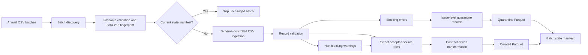

# Chicago Food Inspections Data Quality Pipeline

[](https://github.com/theodev23/chicago-food-inspections-data-quality/actions/workflows/ci.yaml)

An incremental Python ETL pipeline that validates, cleans, quarantines, and
publishes annual Chicago food-inspection data as partitioned Parquet datasets.

The project demonstrates production-oriented data-engineering practices on a
public dataset: configuration-driven processing, an explicit data contract,
deterministic duplicate handling, issue-level quarantine records, atomic
publishing, incremental execution, automated tests, and continuous integration.

## Table of contents

- [Project overview](#project-overview)
- [Runnable demo](#runnable-demo)
- [Key engineering capabilities](#key-engineering-capabilities)
- [Architecture](#architecture)
- [Data source](#data-source)
- [Data contract and quality rules](#data-contract-and-quality-rules)
- [Curated transformations](#curated-transformations)
- [Published outputs](#published-outputs)
- [Reference batch results](#reference-batch-results)
- [Incremental processing](#incremental-processing)
- [Project structure](#project-structure)
- [Getting started](#getting-started)
- [Command-line usage](#command-line-usage)
- [Testing and continuous integration](#testing-and-continuous-integration)
- [Design decisions](#design-decisions)
- [Current scope](#current-scope)
- [License](#license)

## Project overview

The pipeline processes annual CSV batches from the City of Chicago Food
Inspections dataset.

For every incoming batch, it:

1. validates the filename and extracts the batch year;
2. calculates a SHA-256 source fingerprint;
3. checks whether the batch has already been processed unchanged;
4. validates the exact source schema;
5. reads source fields as strings to preserve raw values;
6. applies batch-level and record-level data-quality rules;
7. separates blocking errors from non-blocking warnings;
8. publishes invalid records to an issue-level quarantine dataset;
9. transforms accepted records into a typed curated schema;
10. writes compressed Parquet outputs and a state manifest.

The project is configured for annual batches from 2019 through 2025. Source
CSV files and generated outputs are intentionally excluded from the repository.


## Runnable demo

A self-contained synthetic batch is included so the complete pipeline can be
evaluated without downloading the external Chicago dataset.

After creating the virtual environment and installing the project, run:

    ./scripts/run_demo.sh

The runner invokes the real project CLI twice. The first execution validates,
transforms, quarantines, and publishes the batch. The second execution confirms
that the unchanged batch is skipped and that existing outputs are not
rewritten.

| Result | Count |
|---|---:|
| Raw records | 7 |
| Accepted records | 5 |
| Rejected records | 2 |
| Blocking errors | 2 |
| Non-blocking warnings | 2 |
| Quarantine issues | 2 |

The demonstration also verifies curated identifiers, nullable warning
transformations, quarantine rule identifiers, duplicate lineage, state
manifest counts, and output timestamps.

See [the runnable demo documentation](demo/README.md) for the synthetic
scenarios, generated artifacts, and dedicated integration test.

## Key engineering capabilities

- Python 3.12 application using a `src` package layout
- pandas-based ingestion, validation, and transformation
- PyArrow-backed Parquet publishing
- YAML pipeline configuration and versioned data contract
- exact source-schema enforcement
- deterministic exact-duplicate detection
- error and warning severity levels
- issue-level quarantine records with traceability metadata
- partitioned Snappy-compressed Parquet outputs
- atomic output replacement
- SHA-256 input fingerprints and persisted state manifests
- idempotent skip behavior for unchanged batches
- single-batch and multi-batch command-line execution
- human-readable and JSON execution summaries
- unit and integration tests with pytest
- linting and formatting checks with Ruff
- GitHub Actions continuous integration

## Architecture



## Data source

The source is the public
[City of Chicago Food Inspections dataset](https://data.cityofchicago.org/Health-Human-Services/Food-Inspections/4ijn-s7e5).

- Socrata dataset identifier: `4ijn-s7e5`
- source grain: one food inspection per row
- source columns: 17
- configured project period: 2019-2025
- local batch format: one CSV file per calendar year

The source portal notes that duplicate inspection reports may remain in the
published data. The pipeline therefore applies an explicit and deterministic
duplicate policy before publishing curated records.

Expected input filenames follow this convention:

```text
data/incoming/food_inspections_2019.csv
data/incoming/food_inspections_2020.csv
data/incoming/food_inspections_2021.csv
...
data/incoming/food_inspections_2025.csv
```

Only files matching the configured filename pattern and year range are
discovered.

## Data contract and quality rules

The versioned data contract is stored in:

```text
config/data_contract.yaml
```

It defines:

- the primary key;
- the exact source columns and their order;
- target column names;
- target data types;
- nullability;
- cleaning operations;
- allowed categorical values;
- string patterns;
- numeric ranges;
- record-level rules;
- batch-level rules;
- issue severity and processing action.

### Batch-level rules

| Rule | Severity | Action |
|---|---|---|
| Incoming columns must exactly match the documented schema | Error | Fail the batch |
| An incoming file must contain at least one data row | Error | Fail the batch |
| The filename must contain a configured four-digit year | Error | Fail the batch |

Batch-level structural failures stop processing because the source cannot be
interpreted safely.

### Record-level rules

| Rule | Severity | Behavior |
|---|---|---|
| `inspection_id` must be present, numeric, positive, and unique | Error | Quarantine |
| `inspection_date` must be valid and match the batch year | Error | Quarantine |
| `results` must belong to the documented result domain | Error | Quarantine |
| Latitude and longitude must both be present or both be null | Error | Quarantine |
| Coordinates must remain within valid geographic ranges | Error | Quarantine |
| State and ZIP values must match their documented patterns | Error | Quarantine |
| Exact business duplicates are compared without `inspection_id` | Error | Quarantine duplicate |
| Missing or unknown risk values | Warning | Retain the record |
| License number equal to zero | Warning | Retain and convert to null |

### Exact-duplicate policy

Two rows are considered exact business duplicates when all 16 source fields
other than `inspection_id` are identical.

The policy is deterministic:

1. compare every source column except the primary key;
2. retain the row with the lowest numeric `inspection_id`;
3. quarantine the other row;
4. store the retained identifier in
   `dq_duplicate_of_inspection_id`.

This preserves one canonical inspection while maintaining traceability for the
rejected duplicate.

### Error and warning semantics

An **error** is blocking. The affected source record is excluded from curated
output and represented in quarantine.

A **warning** is non-blocking. The record remains eligible for curated output,
but the issue is counted in the validation summary and state manifest.

One source record may produce several quarantine rows when it violates several
blocking rules because quarantine output is issue-level rather than
record-level.

## Curated transformations

Accepted source records are transformed according to the data contract.

The transformation layer performs the following operations:

- renames source fields to stable target names;
- trims leading and trailing whitespace;
- collapses repeated internal whitespace;
- converts blank nullable strings to null;
- uppercases city and state values;
- converts `inspection_id` to `int64`;
- converts license numbers to nullable `Int64`;
- converts the license sentinel value `0` to null;
- converts latitude and longitude to `float64`;
- converts inspection timestamps to date values;
- removes the redundant raw `location` field;
- adds the `inspection_year` partition column;
- preserves the raw semi-structured `violations` text.

The transformation does not mutate the raw DataFrame supplied to it.

## Published outputs

### Curated dataset

Curated records are written to a Hive-style annual partition:

```text
data/curated/
└── inspection_year=2019/
    └── food_inspections_2019.parquet
```

The curated dataset contains one row per accepted inspection and uses the target
schema defined by the data contract.

Properties:

- format: Parquet;
- compression: Snappy;
- partition key: `inspection_year`;
- write strategy: temporary file followed by atomic replacement.

### Quarantine dataset

Blocking validation issues are written to a separate annual partition:

```text
data/quarantine/
└── dq_batch_year=2019/
    └── food_inspections_2019_quarantine.parquet
```

Quarantine output preserves all 17 raw source fields and adds eight
data-quality metadata fields:

```text
dq_source_row_number
dq_rule_id
dq_column
dq_value
dq_message
dq_severity
dq_duplicate_of_inspection_id
dq_batch_year
```

`dq_source_row_number` refers to the physical CSV line number, including the
header row. This allows an issue to be traced back to the original source file.

Quarantine output is issue-level. A source record may therefore appear more
than once when several blocking rules fail.

### State manifest

Each successfully published annual batch has a JSON state manifest:

```text
data/state/
└── chicago_food_inspections_2019.json
```

The manifest records:

- dataset and batch year;
- source path, size, checksum, and checksum algorithm;
- raw, accepted, rejected, error, and warning counts;
- curated output path, row count, size, and compression;
- quarantine output path, row count, size, and compression;
- successful completion timestamp;
- manifest schema version.

Generated source files, Parquet datasets, state manifests, reports, and logs are
excluded from Git.

## Reference batch results

The following metrics come from the locally processed 2019 reference batch.

The source snapshot is identified by this SHA-256 checksum:

```text
5c3aaa964c11a7b8b2b09882706f97429e89ee673b88cb4c5dfcc1656e478615
```

| Metric | Result |
|---|---:|
| Source size | 27,271,051 bytes |
| Raw records | 19,052 |
| Accepted records | 19,047 |
| Rejected records | 5 |
| Acceptance rate | 99.97% |
| Blocking validation issues | 5 |
| Non-blocking warnings | 43 |
| Curated columns | 17 |
| Curated size | 8,478,651 bytes |
| Quarantine rows | 5 |
| Quarantine columns | 25 |
| Quarantine size | 15,859 bytes |

The five rejected records were exact duplicates. The row with the lowest
`inspection_id` in each duplicate group was retained.

The 43 warnings consisted of:

- 37 zero-valued license numbers converted to null;
- 6 missing risk values retained as nullable values.

A subsequent execution of the unchanged batch returned:

```text
status: skipped
reason: batch_state_current
```

The pipeline reused the persisted state rather than reading, validating,
transforming, and publishing the source batch again.

These metrics describe the project reference snapshot. They are not intended to
represent the continuously updated public dataset.

## Incremental processing

Incremental behavior is based on a SHA-256 source fingerprint and persisted
output metadata.

Before reading an annual CSV, the pipeline:

1. calculates the configured source checksum;
2. loads the existing state manifest for that batch year;
3. compares the source size, checksum algorithm, and checksum;
4. verifies that the recorded curated and quarantine files exist;
5. verifies that their current file sizes match the manifest.

When every condition is satisfied, the batch receives the `skipped` status.

A batch is processed again when:

- its source content changes;
- its source size or checksum changes;
- its state manifest is absent;
- its curated output is absent or has an unexpected size;
- its quarantine output is absent or has an unexpected size.

The state manifest is written only after both Parquet outputs have been
published successfully.

### Multi-batch execution

The `--all` mode:

1. loads the configured input directory and filename pattern;
2. discovers annual CSV files in the configured year range;
3. orders them deterministically by year and filename;
4. processes or skips each batch sequentially;
5. returns aggregate discovered, processed, and skipped counts.

The runner uses fail-fast behavior. An unexpected failure stops the execution
instead of silently continuing with a partially successful multi-batch run.

Example summary for the current local input directory:

```json
{
  "mode": "all",
  "status": "success",
  "summary": {
    "discovered": 1,
    "processed": 0,
    "skipped": 1
  }
}
```

## Project structure

```text
.
├── .github/
│   └── workflows/
│       └── ci.yaml
├── config/
│   ├── data_contract.yaml
│   ├── demo_pipeline.yaml
│   └── pipeline.yaml
├── data/
│   ├── archive/
│   ├── curated/
│   ├── incoming/
│   ├── quarantine/
│   ├── reports/
│   └── state/
├── demo/
│   ├── input/
│   │   └── food_inspections_2019.csv
│   ├── README.md
│   └── expected_summary.json
├── docs/
├── logs/
├── scripts/
│   ├── run_demo.py
│   └── run_demo.sh
├── src/
│   └── data_quality_pipeline/
│       ├── __init__.py
│       ├── batch.py
│       ├── cli.py
│       ├── config.py
│       ├── contract.py
│       ├── curated_writer.py
│       ├── duplicates.py
│       ├── ingestion.py
│       ├── multi_batch_runner.py
│       ├── pipeline_runner.py
│       ├── quarantine.py
│       ├── quarantine_writer.py
│       ├── state_manifest.py
│       ├── transformation.py
│       ├── validation.py
│       └── validation_runner.py
├── tests/
│   ├── integration/
│   │   └── test_demo_script.py
│   └── unit/
├── .gitignore
├── pyproject.toml
└── README.md
```

### Module responsibilities

| Module | Responsibility |
|---|---|
| `config.py` | Load and validate pipeline configuration |
| `contract.py` | Load and validate the versioned data contract |
| `batch.py` | Discover annual batches and inspect source metadata |
| `ingestion.py` | Read CSV data using the exact raw schema |
| `validation.py` | Implement individual record-validation rules |
| `validation_runner.py` | Execute and aggregate batch validation |
| `duplicates.py` | Detect deterministic exact duplicates |
| `quarantine.py` | Build issue-level quarantine records |
| `transformation.py` | Transform accepted source records |
| `curated_writer.py` | Publish curated Parquet output |
| `quarantine_writer.py` | Publish quarantine Parquet output |
| `state_manifest.py` | Persist and validate incremental state |
| `pipeline_runner.py` | Orchestrate one annual batch |
| `multi_batch_runner.py` | Discover and execute all annual batches |
| `cli.py` | Expose the command-line interface |

## Getting started

### Requirements

- Python 3.12
- Git
- one or more annual CSV exports from the Chicago Food Inspections dataset

### Clone the repository

```bash
git clone https://github.com/theodev23/chicago-food-inspections-data-quality.git
cd chicago-food-inspections-data-quality
```

### Create and activate a virtual environment

On macOS or Linux:

```bash
python3.12 -m venv .venv
source .venv/bin/activate
```

On Windows PowerShell:

```powershell
py -3.12 -m venv .venv
.venv\Scripts\Activate.ps1
```

### Install the project

```bash
python -m pip install --upgrade pip
python -m pip install -e ".[dev]"
```

The editable installation exposes the command:

```text
food-inspections-pipeline
```

### Prepare incoming data

The pipeline does not download source data automatically.

Prepare one CSV per calendar year and place each file in `data/incoming` using
this convention:

```text
food_inspections_<year>.csv
```

Example:

```text
data/incoming/food_inspections_2019.csv
```

The source file must contain exactly the 17 columns documented in
`config/data_contract.yaml`, in the documented order.

The default configuration discovers files from 2019 through 2025 matching:

```text
food_inspections_*.csv
```

Source CSV files and generated pipeline outputs are ignored by Git.

## Command-line usage

The installed command supports two execution modes:

- process one explicitly selected annual CSV batch;
- discover and process every configured incoming batch.

Exactly one mode must be selected.

### Display the command help

```bash
food-inspections-pipeline --help
```

### Process one annual batch

```bash
food-inspections-pipeline \
  data/incoming/food_inspections_2019.csv
```

The command validates the filename, calculates the source checksum, checks the
persisted state, and either processes or skips the batch.

### Process all discovered batches

```bash
food-inspections-pipeline --all
```

This mode discovers files from the configured incoming directory using:

```text
food_inspections_*.csv
```

Only files whose year belongs to the configured 2019-2025 range are eligible.

### Produce machine-readable JSON

For one annual batch:

```bash
food-inspections-pipeline \
  data/incoming/food_inspections_2019.csv \
  --json
```

For every discovered batch:

```bash
food-inspections-pipeline --all --json
```

JSON output includes:

- execution status;
- batch path, year, size, and checksum;
- validation error and warning counts;
- raw, accepted, rejected, and quarantine counts;
- curated and quarantine output metadata;
- persisted state information for skipped batches;
- aggregate counts in multi-batch mode.

### Use alternative configuration files

```bash
food-inspections-pipeline \
  data/incoming/food_inspections_2019.csv \
  --config custom/pipeline.yaml \
  --contract custom/data_contract.yaml
```

The same options can be used with multi-batch execution:

```bash
food-inspections-pipeline \
  --all \
  --config custom/pipeline.yaml \
  --contract custom/data_contract.yaml
```

### Exit behavior

The command returns:

- exit code `0` after a successful processed or skipped execution;
- exit code `1` when configuration, ingestion, validation orchestration,
  transformation, or persistence raises an error;
- an argparse usage error when neither or both execution modes are selected.

Operational errors are printed to standard error with the originating exception
type and message.

## Testing and continuous integration

The project uses pytest for automated testing and Ruff for static quality
checks.

### Run the complete test suite

```bash
python -m pytest
```

Current reference result:

```text
339 passed
```

The test suite covers:

- pipeline configuration loading and validation;
- data-contract loading and structural validation;
- incoming batch discovery;
- filename and batch-year validation;
- source metadata inspection and SHA-256 hashing;
- exact CSV schema enforcement;
- raw CSV ingestion behavior;
- inspection identifier validation;
- inspection date and batch-year validation;
- inspection-result domain validation;
- coordinate consistency and range validation;
- state and ZIP pattern validation;
- license-number and risk warnings;
- deterministic exact-duplicate detection;
- error and warning aggregation;
- issue-level quarantine construction;
- curated record transformation;
- curated Parquet publishing;
- quarantine Parquet publishing;
- batch-state manifest persistence;
- unchanged-batch detection;
- single-batch pipeline orchestration;
- multi-batch discovery and execution;
- command-line parsing and JSON summaries.

The integration tests verify:

1. the complete incremental lifecycle for a new annual batch;
2. publication of curated, quarantine, and state outputs;
3. skip behavior for an unchanged second execution;
4. protection against output rewrites during a skipped execution;
5. execution of the self-contained demo from an external working
   directory;
6. validation and cleanup of all generated demo artifacts.

### Run Ruff checks

Lint the repository:

```bash
python -m ruff check .
```

Verify formatting without changing files:

```bash
python -m ruff format --check .
```

Apply Ruff formatting locally:

```bash
python -m ruff format .
```

### Continuous integration

The GitHub Actions workflow is stored in:

```text
.github/workflows/ci.yaml
```

It runs on:

- every pull request;
- every push to `main`.

The workflow:

1. checks out the repository;
2. installs Python 3.12;
3. restores or creates the pip dependency cache;
4. installs the project and development dependencies;
5. runs Ruff linting;
6. verifies Ruff formatting;
7. runs the complete pytest suite.

The executed quality commands are:

```bash
python -m ruff check .
python -m ruff format --check .
python -m pytest
```

Workflow permissions are restricted to read-only repository contents:

```yaml
permissions:
  contents: read
```

Concurrent workflow runs use a branch-specific group. An obsolete run for the
same branch or pull request is cancelled when a newer run starts.

Both the pull-request workflow and the subsequent push workflow on `main` were
successfully verified when CI was introduced.

## Design decisions

### Preserve raw values during ingestion

Every CSV field is initially read as a string.

This prevents automatic type inference from silently modifying identifiers,
ZIP codes, null representations, malformed numbers, or timestamps before the
validation layer examines them.

### Validate before transforming

Validation operates on the raw source representation. Cleaning and type
conversion are applied only after blocking issues have been identified.

This separation preserves the evidence required to explain why a value failed
and ensures that quarantine records contain the original source content.

### Separate operational configuration from data semantics

The project uses two YAML files with distinct responsibilities:

- `config/pipeline.yaml` defines paths, year range, filename pattern, hashing,
  output format, compression, and partitioning;
- `config/data_contract.yaml` defines schema, types, nullability, cleaning,
  domains, validation rules, severity, and actions.

This separation allows operational settings to change without rewriting the
meaning of the dataset.

### Quarantine invalid data instead of silently dropping it

Blocking issues remain available in a dedicated Parquet dataset with:

- the original source fields;
- the source row number;
- the failed rule identifier;
- the affected column and value;
- a human-readable validation message;
- the issue severity;
- the annual batch identifier;
- the retained inspection identifier for duplicate records.

This makes rejection behavior auditable and supports later remediation.

### Use issue-level quarantine records

A quarantined source row is emitted once per blocking validation issue.

Compared with one generic rejected-row record, this design makes independent
rule failures explicit and allows quality metrics to be aggregated by rule,
column, severity, or batch.

### Retain one deterministic duplicate

Exact business duplicates are resolved by retaining the lowest numeric
`inspection_id`.

A deterministic policy produces reproducible outputs regardless of source row
order and avoids arbitrary first-row retention.

### Store incremental state outside the datasets

A small JSON manifest records the source fingerprint and published output
metadata for each annual batch.

The runner can therefore determine whether work is current without scanning the
full curated and quarantine Parquet datasets.

### Publish outputs atomically

Parquet datasets and JSON manifests are written to temporary files before the
destination is replaced.

A partially written file is not presented as a successfully published output,
and the state manifest is persisted only after both data outputs succeed.

### Prefer deterministic execution

The following behaviors are deterministic:

- discovered batch order;
- validation issue order;
- duplicate retention;
- output paths;
- partition paths;
- state-manifest paths;
- JSON summary structure.

Determinism improves reproducibility, automated testing, and operational
debugging.

## Current scope

### Implemented

- annual CSV batch discovery for a configured year range;
- source filename and batch-year validation;
- SHA-256 source fingerprinting;
- exact source-schema enforcement;
- non-empty batch enforcement;
- record-level data-quality validation;
- blocking errors and non-blocking warnings;
- deterministic exact-duplicate handling;
- issue-level quarantine construction;
- contract-driven cleaning and type conversion;
- curated and quarantine Parquet publishing;
- Snappy compression and annual partitioning;
- atomic file replacement;
- persisted JSON state manifests;
- incremental skip behavior for unchanged batches;
- single-batch and multi-batch CLI execution;
- human-readable and JSON execution summaries;
- unit and integration testing;
- Ruff linting and formatting;
- GitHub Actions continuous integration.

### Not currently implemented

- automatic extraction from the Socrata API;
- automatic creation of annual source CSV files;
- persisted profiling or before-and-after quality reports;
- dashboards or business-intelligence visualizations;
- structured application log files;
- automatic movement of completed inputs to `data/archive`;
- recovery and continuation after a failed batch in `--all` mode;
- loading curated data into PostgreSQL or another database;
- orchestration with Airflow, Dagster, Prefect, or a cloud scheduler;
- cloud object-storage publishing;
- schema evolution across contract versions.

These exclusions keep the current implementation focused on a transparent,
testable, local batch-processing pipeline while providing clear extension
points for future iterations.

The repository currently includes a verified 2019 reference run. The pipeline
configuration supports annual input batches from 2019 through 2025 when the
corresponding source files are supplied locally.

## License

This project is licensed under the [MIT License](LICENSE).
